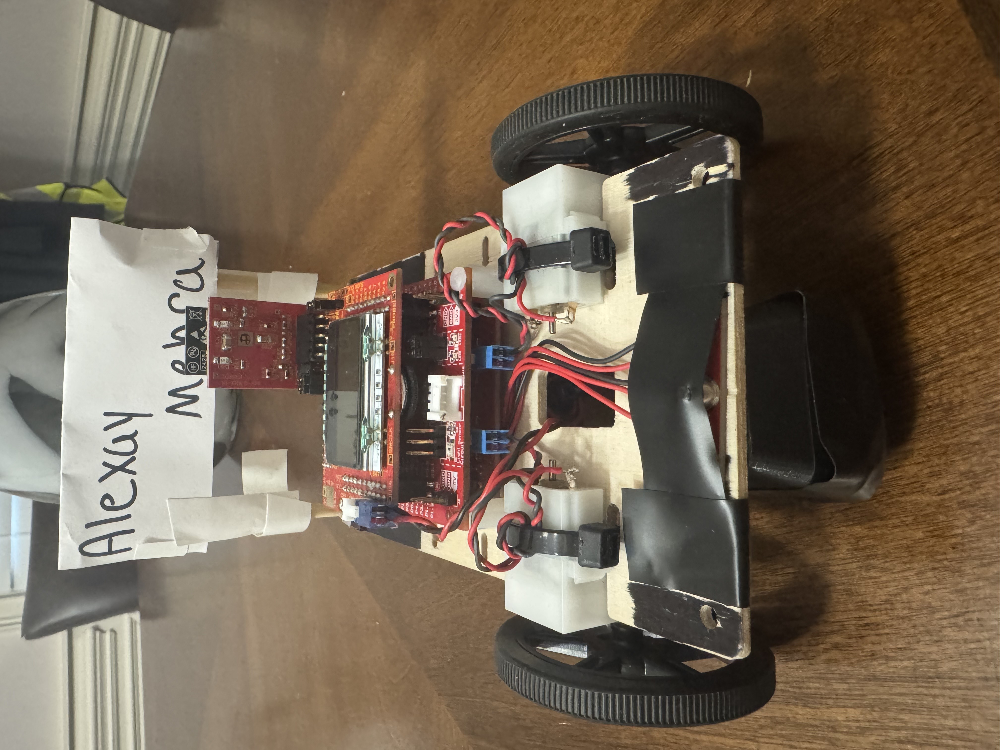
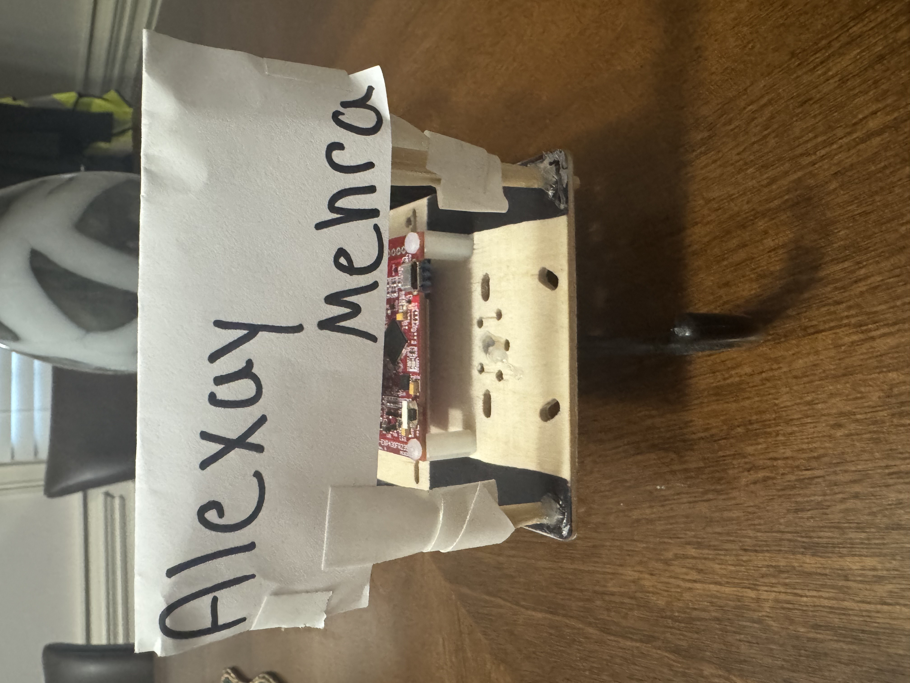
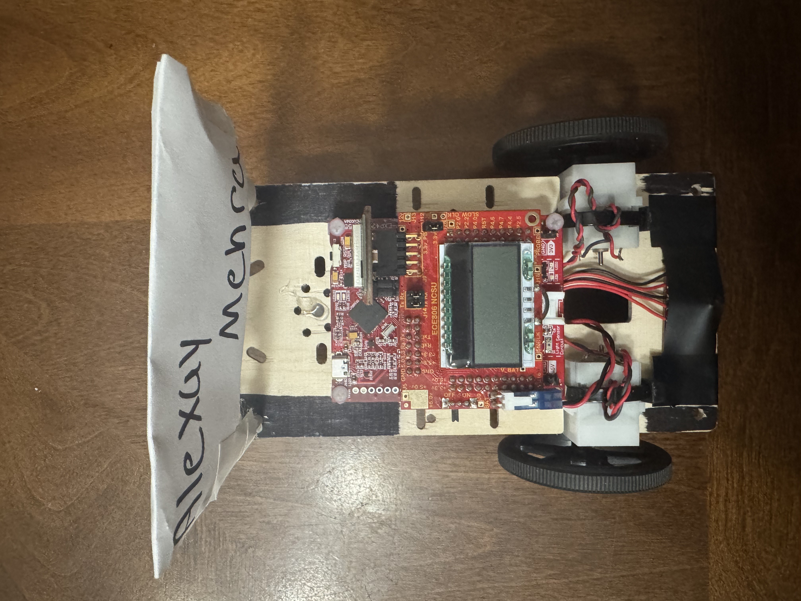
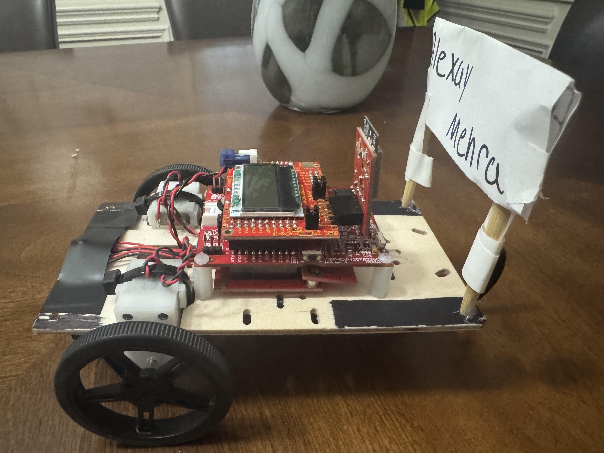
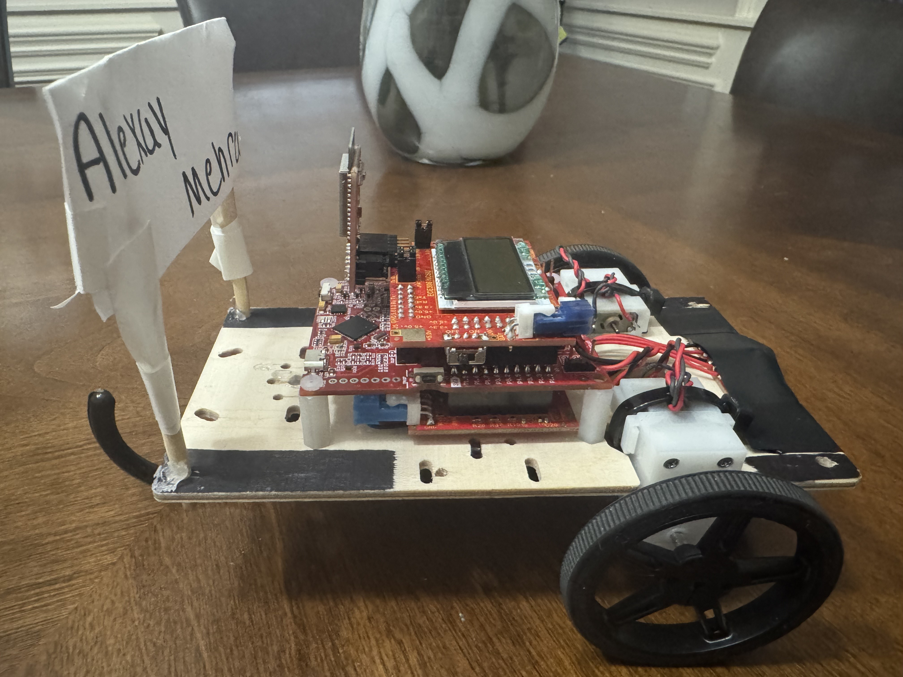

# MSP430 Embedded Car

## Table of Contents
* [Overview](#overview)
* [Features](#features)
* [Hardware](#hardware)
* [Software](#software)
* [Images](#images)
* [Videos](#videos)
* [License](#license)
* [Contact](#contact)

## Overview
The **MSP430 Embedded Car** is a class project that uses the MSP430FR2355 microcontroller and other peripherals to enable remote-controlled movements and functions, as well as autonomous black-line detection and following. This project demonstrates how embedded C programming can be used to control a physical system.

## Features
* PWM control for vehicle movement
* DAC voltage control for stable motion
* Sensor calibration for accurate line-detection values
* Real‑time, interrupt‑driven sensor readings (ADC / timers / ports)
* Line detection and line‑following logic based on IR detector inputs
* IOT / Wi-Fi communication module support for remote control
* Modular code organization for easy customization

## Hardware
* MSP430FR2355 microcontroller
* LCD display board
* FET board
* Motors
* IR emitter and detector board
* ESP32 IOT module

## Software
This project was built with Code Composer Studio 12.8.1

## Images

  
  
  

  
  

## Videos
* [line following](https://youtu.be/s-ASt64qS2Q)
* [remote commands](https://youtu.be/0eoND6Sw71E)

## License
This project is released under the **MIT License.** See the [LICENSE](LICENSE) file for full text.
  
## Contact
Created and maintained by **Alexay Mehra**.

